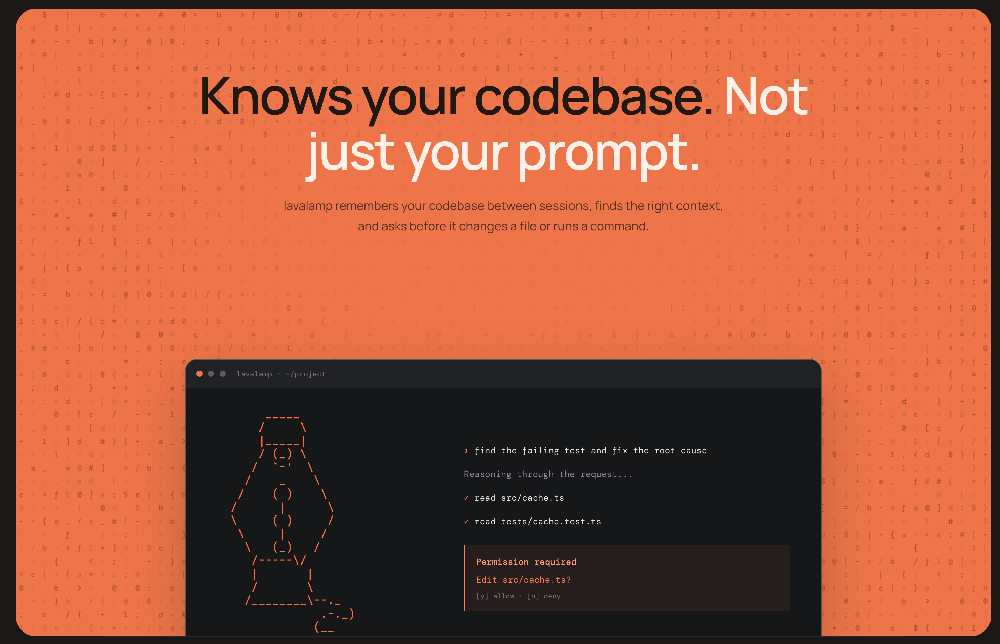
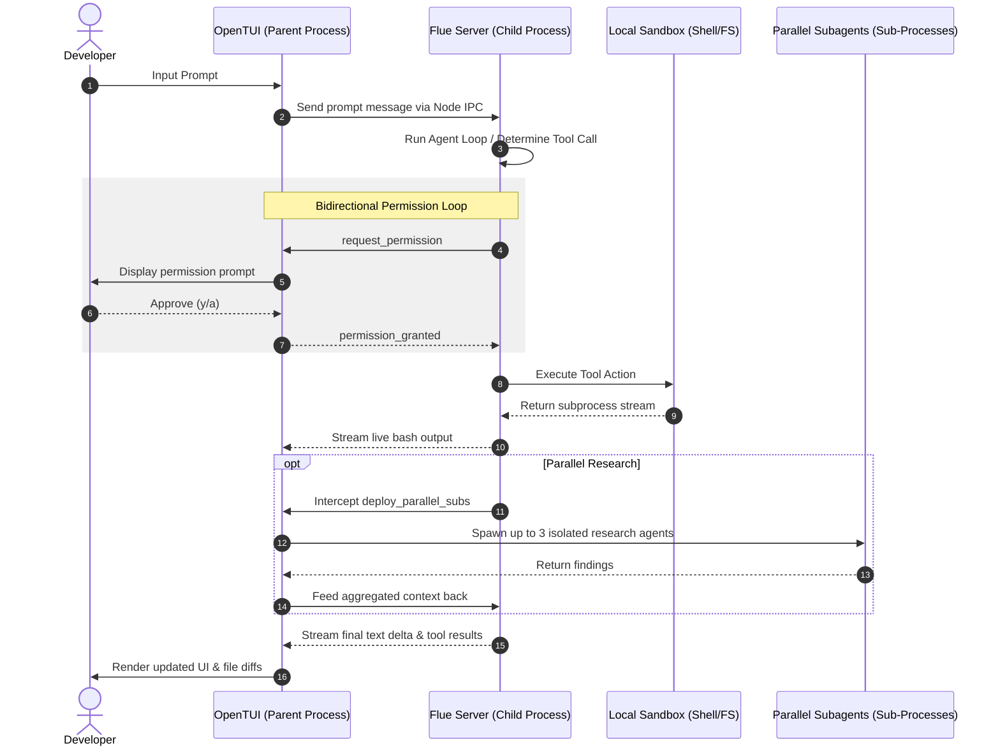
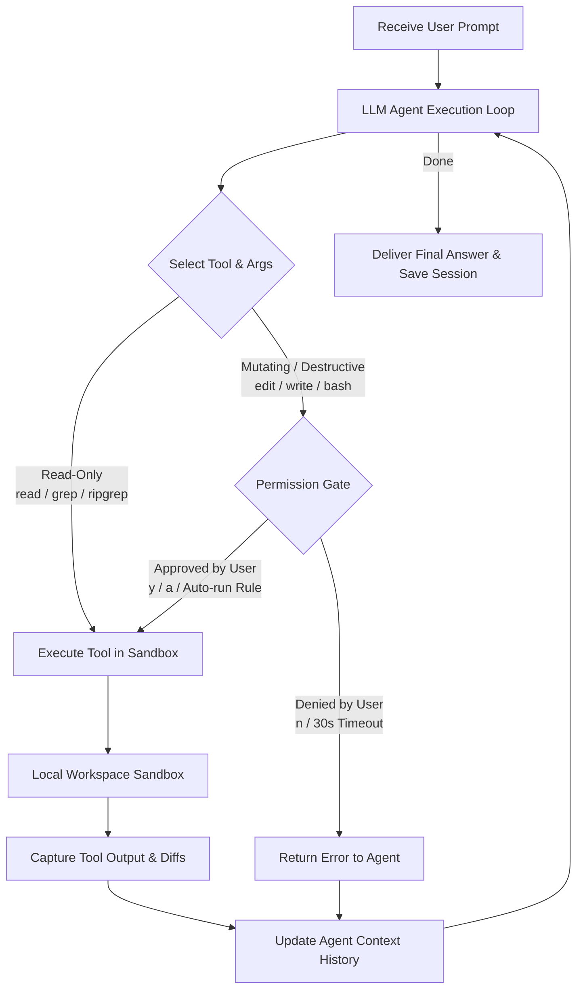
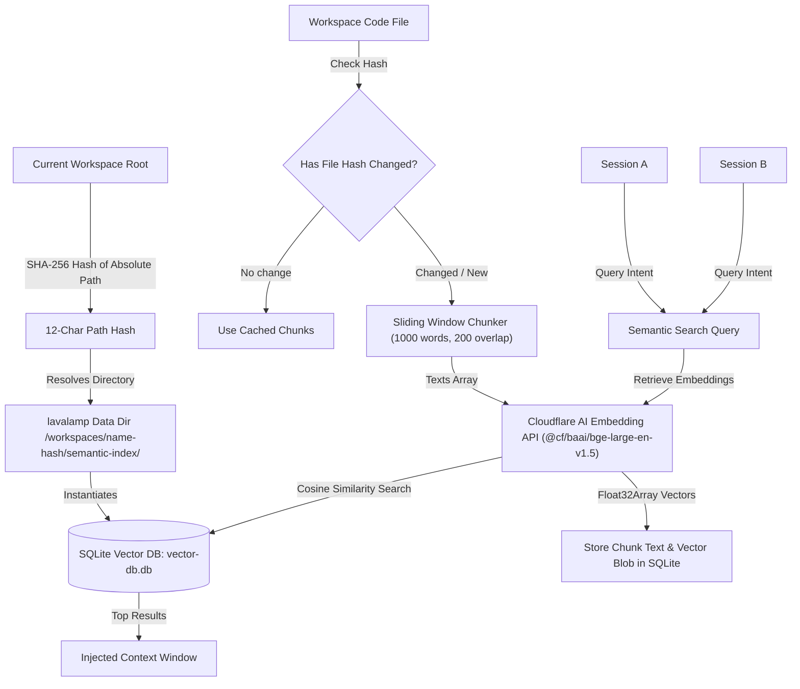

# lavalamp
**lavalamp** is a local, terminal-based AI coding assistant built for Cloudflare. 

It runs on your machine and edits code directly in your workspace. By logging in with your Cloudflare credentials, it runs **Workers AI** models billed directly to your account. You can also configure your own API keys for Anthropic, OpenAI, or OpenRouter.

---

## Why this exists

Here is what makes it different:

* **Cloudflare-First**: Runs models on your own Cloudflare account. It reuses Wrangler OAuth credentials to log in.
* **Reliable Edits**: Small models often struggle with whole-file rewrites. The agent uses `hashline` to edit files via precise, hash-anchored patches.
* **Terminal UI**: Built using `@opentui/core`. It streams markdown, renders toggle boxes for tool calls and thinking blocks, and includes full-screen diff and code viewers with Vim bindings (`j`/`k`, `:q`, etc.).
* **Permissions**: Every file modification or shell command requires your approval. You can allow, deny, or configure "always allow" rules. Stalled prompts auto-deny after 30 seconds.
* **Mixture of Experts**: The main agent can delegate analysis to specialized, read-only experts (like `logic` for typing or `spectacle` for converting pasted screenshots) to preserve context.

---

## Quick Start

### Prerequisites
* You need [Bun](https://bun.sh/) (>= 1.3.14) installed.
* A Cloudflare account (or API keys for fallback providers like Anthropic/OpenAI).

### Installation
Install the precompiled binary for your system:
```bash
curl -fsSL https://raw.githubusercontent.com/rahuletto/lavalamp/main/install.sh | bash
```

**How the installer works:**
The script detects your OS and architecture (including Rosetta translation on macOS), downloads the platform binary from GitHub Releases, moves it to `~/.agents/bin/`, and appends this path to your shell configuration (`.zshrc`, `.bashrc`, `.bash_profile`, or `config.fish`).

Alternatively, build from source:
```bash
git clone https://github.com/rahuletto/lavalamp.git
cd lavalamp
bun install
bun run build
bun link
```

### Log in
Authenticate with Cloudflare:
```bash
lavalamp login
```
Check status or log out:
```bash
lavalamp status
lavalamp logout
```

---

## How to use the CLI

```bash
lavalamp [command/flag]
```

### Main Commands

| Command | Action |
|:---|:---|
| `lavalamp` | Start an interactive coding session in the current directory. |
| `lavalamp ask` | Start a read-only interactive session to explore code. |
| `lavalamp ask "your question"` | Ask a single question about the codebase and exit. |
| `lavalamp models` | List known models, context window sizes, and capabilities. |
| `lavalamp config show` | Print current configuration (default model, AI Gateway status). |
| `lavalamp config set <key> <value>` | Update settings (e.g. `lavalamp config set model <model-id>`). |

### CLI Flags

| Flag | Description |
|:---|:---|
| `-p`, `--print "your prompt"` | Run a single instruction, print the response, and exit. |
| `--repl` | Run a multi-turn chat directly in your terminal line-by-line (no TUI). |
| `--simple` | Run a plain terminal chat loop (uses a simple `>` prompt and silences spinners/logs). |
| `--continue [session_id]` | Resume a previous session. Run without an ID to choose from history. |
| `--workspace <path>` | Set a custom workspace folder (defaults to current directory). |
| `--model <model_id>` | Use a specific model for this run only. |
| `--output-format <text\|json>` | Format stdout output (useful with `-p` or `--repl`). |
| `--quiet` | Hide diagnostic status messages, only showing the agent's output. |

### The `--simple` Flag

Use `--simple` to run lavalamp in standard scrollback buffers, pipeline scripts, or screen readers. It skips the full-screen TUI rendering, silences background status updates, and outputs plain text directly to stdout.

---

## TUI Shortcuts & Commands

### Slash Commands
Type these commands directly into the prompt input box:

* `/help` - List all commands.
* `/clear` - Clear conversation history and start fresh.
* `/plan` - Toggle Plan Mode (changes input bar to a teal accent) to design tasks before building.
* `/sessions` - Open a list of past sessions to pick one to resume.
* `/memory` - View or update the persistent project memory.
* `/model` - List or switch the active model.
* `/workspace` - Change the workspace directory.
* `/skills` - List or load customized skills from `.agents/skills`.
* `/permissions` - View or update your security rules.
* `/autorun` - Manage commands allowed to run without prompting.
* `/sudo` - Toggle allow-everything mode (asks for confirmation first).
* `/quit` - Save the current session and exit.

### Full-Screen Keybindings
When viewing large code blocks or file diffs, the TUI opens a full-screen view. You can navigate it using Vim-style bindings:
* `j` / `k` - Scroll down / up by line.
* `Ctrl + d` / `Ctrl + u` - Scroll down / up half a page.
* `Ctrl + f` / `Ctrl + b` - Scroll down / up full page.
* `g` / `G` - Jump to top / bottom.
* `:q` / `Esc` / `q` - Close the viewer and go back to chat.

---

## Architecture

To prevent the terminal UI from locking up during compilation, test suites, or large codebase searches, **lavalamp** separates layout rendering from agent orchestration using a two-process model.



### Process Coordination & Bidirectional IPC

* **Parent Process (OpenTUI)**: Responsible for terminal rendering, event handling, autocompleting files/skills/commands, and displaying unified diffs. The parent process is also responsible for managing permissions and orchestrating parallel subagent executions.
* **Child Process (Flue Server)**: Runs the main agent (`build` or `explore`) under `@flue/runtime`. It manages LLM calls, parses tool definitions, and performs local operations on your files.
* **Two-Way IPC Channel**: Rather than simple one-way piping, the processes maintain a bidirectional channel:
  * The parent process pushes user prompts to the server.
  * The server streams text tokens, reasoning steps, tool statuses, and live tool stdout/stderr (`bash_stream`) back to the TUI.
  * When the server requests a mutating file change or terminal command, it sends a `permission_request` message and pauses. The TUI captures user approval and sends a `permission_response` back to continue execution.
* **Parallel Research Subagents**: When the `deploy_parallel_subs` tool is triggered, the TUI interceptor handles launching up to 3 separate child processes running parallel research prompts. When complete, their findings are automatically merged and fed back to the parent agent.

---

## Permissions & Security

By default, **lavalamp** operates on a zero-trust permission model:
* **Read-only tools** (like `read`, `grep`, `glob`, `ripgrep`) execute silently without prompts.
* **Destructive/Mutating tools** (like `write`, `edit`, `rename`, `bash` shell execution) trigger an interactive permission prompt in the TUI.
* Users can choose:
  * **`[y]` Allow**: Authorize this single command/write.
  * **`[n]` Deny**: Block execution and return an abort error to the LLM.
  * **`[a]` Always Allow**: Authorize this and all future matching commands (adds a pattern to `~/.config/lavalamp/autorun.json`).
* If left unattended, permission requests auto-deny after 30 seconds for safety.

The diagram below shows how the agent evaluates, prompts, and executes tools in the local sandbox:



---

## The Toolbelt Ecosystem

To help you code, search, and refactor, the agent has access to a collection of tools organized into functional groups. The diagram below illustrates how the toolbelt is structured and how each group communicates with the host environment and external services:

<details>
<summary><b>Complete Catalog of Available Tools</b></summary>

#### File Mutations & Git Operations
* `read` - Reads a file from the workspace filesystem.
* `write` - Writes new files directly to the workspace.
* `edit` - Applies precise, hash-anchored patches to files via `@oh-my-pi/hashline`, eliminating the need to rewrite full files.
* `rename` - Renames or moves files within the workspace.
* `undo` - Reverts file mutations by winding back the `ChangeTracker`.
* `history` - Queries the local mutation history log.

#### Codebase Exploration & Search
* `grep` - Searches for string literals within codebase files.
* `ripgrep` - Wraps the `rg` binary to execute regex-based code searches with glob exclusions, file type filters, and case-insensitivity.
* `glob` - Locates file paths matching glob patterns.
* `codebase_search` - Performs fuzzy matching on filenames and file contents.
* `codebase_semantic_search` - Runs vector-indexed semantic queries across the workspace to map conceptual references.

#### Workspace Shell Execution
* `bash` - Executes terminal commands inside the local workspace shell. Stdout and stderr are streamed back in real-time (`bash_stream`) so you can watch compilers, test runs, or bundle scripts execute.

#### Code Intellisense (LSP)
* `lsp_hover` - Inspects types, functions, and documentation comments at the cursor.
* `lsp_definition` - Resolves the declaration path of code symbols (Go-To-Definition).
* `lsp_references` - Resolves where a specific symbol is referenced across the codebase.
* `lsp_rename` - Performs codebase-wide symbol renaming.
* `lsp_diagnostics` - Requests compiler and linter warnings from `typescript-language-server` or `oxlint` after edits.

#### Web & Documentation Retrieval
* `web_search` - Queries the web using DuckDuckGo.
* `fetch_url` - Fetches a webpage and converts it into markdown using the r.marban.lol reader API.
* `deepwiki` - Integrates with the DeepWiki MCP to scan repository documentation.
* `load_skill` - Imports bundled instructions or skills (`.agents/skills/`) on demand.

#### Delegation & Subagents
* `deploy_parallel_subs` - Instructs the parent process to spawn up to 3 isolated subagents in parallel to run concurrent research tasks.
* `query_expert` - Delegates read-only exploration or critiques to specialised experts (e.g. `logic`, `refactor`, `database`) to keep the main agent's context clean.
* `oracle` - Queries a cheaper secondary model for quick feedback on concepts.
* `doom_loop` - Triggers loop-recovery protocols when the agent is stuck in repetitive steps.

#### Task Orchestration
* `create_task`, `start_task`, `complete_task`, `edit_task`, `delete_task`, `skip_task`, `list_tasks` - Updates task progress, which is tracked visually in the TUI sidebar.

#### Persistent Memory & Sessions
* `memory_read`, `memory_write`, `memory_append` - Reads and updates permanent notes and project guidelines inside the OS-native application directory.
* `sessions`, `session_context`, `pull_session` - Queries past session metadata, loads full transcripts, and injects session contexts on demand.

</details>

---

## Semantic Indexing & Session Sharing

To allow natural, intent-based searches across your codebase (instead of just exact keyword lookups), **lavalamp** maintains a persistent local semantic vector database.

The diagram below shows how the semantic index is generated, stored, and shared seamlessly across sessions:



### How the Semantic Search Works

* **Storage Location**: The vector database does not pollute your project directory. It is stored as a SQLite database (`vector-db.db`) inside a dedicated workspace folder under your OS-native application data directory:
  * **macOS**: `~/Library/Application Support/lavalamp/workspaces/${workspace_name}-${path_hash}/semantic-index/vector-db.db`
  * **Linux**: `~/.local/share/lavalamp/workspaces/${workspace_name}-${path_hash}/semantic-index/vector-db.db`
  * **Windows**: `%LOCALAPPDATA%/lavalamp/workspaces/${workspace_name}-${path_hash}/semantic-index/vector-db.db`
* **Indexing Loop**: Files are processed using a sliding-window text chunker (default size: 1000 words, overlap: 200 words). The texts are sent to the Cloudflare AI Workers Embeddings endpoint running `@cf/baai/bge-large-en-v1.5` using your credentials.
* **SQLite Vector Storage**: The resulting floating-point embedding vectors are stored on disk as binary blobs (`BLOB` format) inside `bun:sqlite` tables:
  * `files`: Maps workspace file paths to their last known content hashes to bypass indexing if the file has not changed.
  * `chunks`: Stores chunk offsets, raw texts, and raw vector embedding arrays.
* **Cross-Session Sharing**: Because the SQLite database is tied to the unique hash of the absolute workspace directory path rather than any single session identifier, **the index is shared across all past and future sessions**. When you load a new chat, start a separate session, or resume an existing transcript via `--continue`, the agent immediately uses the existing precompiled vector database, avoiding redundant API calls and processing delays.

---

## Mixture of Experts Roster

If the main agent needs specialized help, it can delegate read-only work to expert sub-profiles. These use distinct system instructions and models:

| Expert | Focus Area | Default Model Route |
|:---|:---|:---|
| `refactor` | Clean code standards, deduplication, and refactoring. | `kimi-k2.7-code` |
| `logic` | Complex algorithmic reasoning and type checks. | `glm-5.2` |
| `database` | Schema design, SQL queries, migration plans, and indexes. | `glm-5.2` |
| `oracle` | Global codebase queries and documentation lookups. | `llama-3.3-70b` |
| `critique` | Security audits and code quality reviews. | `llama-3.3-70b` |
| `spectacle`| Image/Screenshot translator. | `llama-4-scout` |
| `ui` | Layouts, styling, frontend design, and terminal UI issues. | `kimi-k2.7-code` |
| `research` | Web searches and API documentation lookups. | `kimi-k2.7-code` |

---

## Contributing & Development

We use Bun to manage packages and build files:

```bash
# 1. Install dependencies
bun install

# 2. Start building server files in watch mode (dist/server.mjs)
bun run dev

# 3. Build the production target
bun run build

# 4. Run tests
bun test
bun run e2e
```

---

## License
This project is licensed under the MIT License. See [LICENSE](LICENSE) for details.
